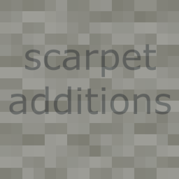

# scarpet-additions



## A Carpet extension for some additional scarpet functions

Message me on discord: replaceitem#9118

## Functions

### `convert_color(color,model,output)`

Converts a color from one `model` to another.

`color` -> List: Depending on specified `model`

`model` -> String: Input color model, can be `RGB`, `RGBA` or `HSB`

* RGB: List of a red, green and blue value
* RGBA: List of a red, green, blue and alpha value
* HSB: List of a hue, saturation and brightnes value

`output` -> String: Output color model, can be `RGB`, `RGBA`, `HEX` or `NUM`

* RGB: List of a red, green and blue value
* RGBA: List of a red, green, blue and alpha value
* HEX: String of hex characters (without leading '#') Can be used for `format()`
* NUM: Number representing the color as 4 bytes: 0xRRGGBBAA. Can be used for `'color'` parameter in `draw_shape()`

Examples:

`convert_color([255,128,0],'rgb','hex');` -> `'FF8000'`

`convert_color([255,128,0],'rgb','num');` -> `0xff7f00ff`

`convert_color([0,255,255],'hsb','hex');` -> `'FF0000'`

`convert_color([120,255,255],'hsb','hex');` -> `'00FF00'`

```py
__on_tick() -> (
    if((tick_time() % 2) == 0,
        headerHue = tick_time()%360;
        headerGlossIndex = (floor(tick_time()/3)%40)-10;
        header = [];
        title = 'MinecraftServer';
        for(range(length(title)),
            if(abs(_-headerGlossIndex) < 3,
                c = convert_color([headerHue,abs(_-headerGlossIndex)/3*255,255],'hsb','hex');
            ,
                if(_ < 7,
                    c = convert_color([headerHue,255,190],'hsb','hex');
                ,
                    c = convert_color([headerHue,255,255],'hsb','hex');
                );
            );
            put(header,null,str('b#%s %s',c,slice(title,_,_+1)));
        );
        header = format(header);
        footer = format('r to the server!');
        set_tab_text(header,footer);
  )
);
```

### `virtual_inventory()`, `virtual_inventory(id)`, `virtual_inventory(id,size)`, `virtual_inventory(id,content)`

Virtual inventories are like enderchest, they exist as a inventory which can be accesses with an id from scarpet.

You can see all available virtual inventories with `virtual_inventories()` which returns a list of all id.

You can create a new inventory with `virtual_inventory(id,size)`. The size defines how many rows the inventory should have (1-6).

Running `virtual_inventory(id)` returns the inventory as a List of items, similar to scarpet's `inventory_get()`.

If you run `virtual_inventory(id,content)` with a list as the `content` argument, you can set the items in the inventory from that list.

To remove an inventory again, run `virtual_inventory(id,null)`

For an example, see examples from `open_inventory()`

### `open_inventory(player,title,inventory)`

Opens a virtual inventory in a GUI for a player.

`player` -> Player: The player tto open the inventory for

`title` -> String: The title of the inventory

`inventory` -> Virtual inventory key

Examples:

`open_inventory(player(),'I got a present for you','present');` Opens the inventory with the id 'present' and displays it to the player

```
virtual_inventory('small',1); //create inventory with one row
inv = virtual_inventory('small'); //read inventory content into variable (will be empty at this point)
inv:4 = ['diamond',64,null]; //place a stack of diamonds in the slot 4 (counting from 0)
virtual_inventory('small',inv); //assign the variable back to the inventory
open_inventory(player('replaceitem','I've got a present for you!','small'); //show the inventory to replaceitem 
```

### `http(request_method, url, callback)`

Makes a asynchroous http get request. Can be used to access APIs or other stuff.

`request_method` -> String: request method, can be GET, POST, HEAD, OPTIONS, PUT, DELETE or TRACE 
`url` -> String: URL of request

`callback` -> Function: Callback function that will be called with the response